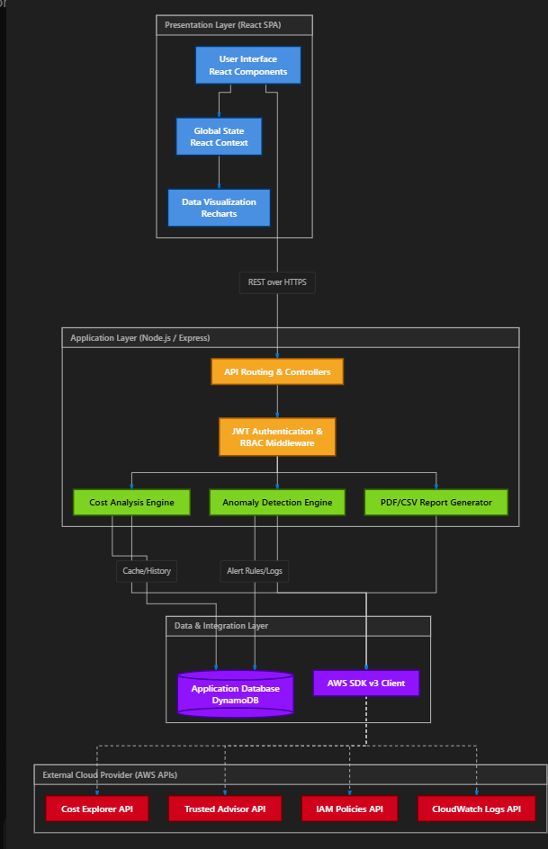
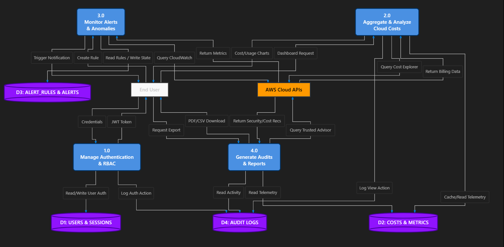
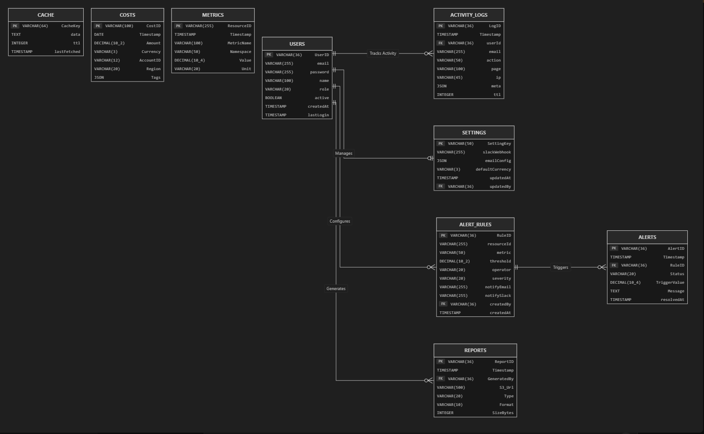

# Final Submission Documentation: CostForge

## 1. Source Code Repository & Overview
**Project Name:** CostForge - Cloud Cost Intelligence Platform  
**Repository:** Maintain the complete solution in your linked Git repository.
**Overview:** CostForge is an enterprise-grade cloud telemetry and FinOps platform designed to ingest, analyze, and visualize AWS billing and infrastructure metrics in real-time.

### Default & Dummy Credentials
The application is pre-seeded with the following roles for evaluation:
* **Admin Role:** `admin@cloudsense.io` / `Admin@CloudSense123`
* **Editor Role:** `d24dce144@charusat.edu.in` / `D24DCE144@heet`
* **Viewer Role:** `heetkv9@gmail.com` / `Heet@123456`

### Assumptions & Limitations
* **Live Data Assumption:** The system is connected to a live AWS environment and does not rely on static mock data.
* **Limitations:** Currently supports AWS only (Azure/GCP planned for Future Enhancements). No multi-region DR implemented in the current MVP.

---

## 2. Hosted Demonstration
**Live Production URL:** [https://dji1sh2llkd41.cloudfront.net](https://dji1sh2llkd41.cloudfront.net)
The solution is fully deployed on AWS infrastructure, using CloudFront and S3 for the frontend, and EC2, Nginx, PM2, and DynamoDB for the backend.

---

## 3. Architecture Documentation & Solution Design
CostForge utilizes a decoupled, modern architecture designed for high availability and low-latency data fetching from AWS APIs (Cost Explorer, Trusted Advisor, CloudWatch).

### Overall System Architecture

### Cloud Infrastructure Deployment

### Data Flow Diagram (DFD)

---

## 4. API Documentation
The CostForge API follows RESTful principles, enforcing JWT-based authentication.
* `POST /api/auth/login` - User authentication
* `GET /api/users/profile` - Fetch RBAC profile
* `GET /api/cost/summary` - Fetches aggregated unblended costs
* `GET /api/cost/by-service` - Cost breakdown by AWS service
* `GET /api/admin/logs` - System-wide audit logs
*(Full OpenAPI/Swagger specs are located in the repository's api documentation folder)*

---

## 5. Database Design
The system utilizes **Amazon DynamoDB**, a highly scalable NoSQL database. Relationships are logically enforced by the Node.js application layer.

### Entity-Relationship Diagram

---

## 6. Test Data
Sufficient sample data is inherently provided because **the application fetches live AWS telemetry directly from the host account**. The pre-seeded dummy users (Admin, Editor, Viewer) allow evaluators to test all RBAC boundaries, alert creation, and report generation using this real-time data.

---

## 7. Deployment Instructions
The application does not use Docker; it is deployed natively on AWS infrastructure.
**Frontend Deployment:**
1. `cd frontend && npm install`
2. `npm run build`
3. Sync the `dist/` folder to the target Amazon S3 bucket.
4. Invalidate the Amazon CloudFront cache.

**Backend Deployment:**
1. SSH into the Amazon EC2 instance.
2. `cd backend && npm install`
3. Configure the `.env` file with AWS IAM Credentials and DynamoDB Region.
4. Start the server using PM2: `pm2 start index.js --name "costforge-api"`
5. Configure Nginx as a reverse proxy targeting port 5000.
